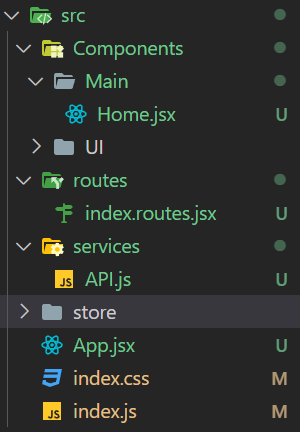

# Installation

petite nouveauté, librairie axios, qui permets de remplacer la méthode fetch native
https://www.npmjs.com/package/axios
<code>npm install axios</code>

ne pas oublié d'installer les autres librairies: router, redux

## étapes:
- routes et composants gestion d'utilisateur : Signup / Signin
- routes et composant Admin
- le reste :)
---
### Structure

- à minima:
    